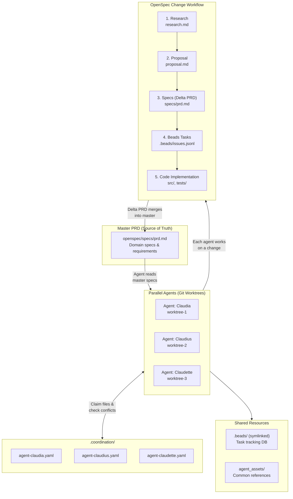

This readme describes set up of a multi-agent coding workflow: the
**OpenSpec-Beads-coordination workflow** (**OBC**). The workflow makes use of [OpenSpec][openspec],
[beads-rust][beads-rust], and [beads-viewer][beads-viewer].

The workflow supports multi-agent work on a single project via git worktrees. Agents use OpenSpec
to research, propose, and spec changes to the project, beads-rust to break down specced changes
into tracked issues, and a communication blueprint to coordinate work and eliminate conflicts when
merging back to main.

This repo contains files necessary for and created by this "agentification" process.



---

**High-level workflow overview**: An initial project-level, "single source of truth", "master" PRD
is created which specifies the project's overview, goals, and domains (for a Python project,
domains can typically be thought of as somewhere between the level of a single module and a single
sub-package directory, inclusive). Agents then work on the project in single-domain "changes",
specified by a change-level "delta" PRD. After the codebase has been updated to implement a
change, the master PRD is updated to reflect the specs of the delta PRD -- we call this "merging"
the delta PRD into the master.

Here I'll exemplify how I agentified the [ETL repo][etl-repo] according to OBC for Claude Code.

Similar set up steps should work for either greenfield or brownfield projects (the ETL repo was
brownfield when agentification was performed). With minor changes, this guide should be able to be
used with other terminal AI agent tools as well (e.g. Cursor, Gemini-CLI, Codex, etc.).

---

## Step 0: Installed prerequisites

First I installed the agent spec frameworks and Claude Code utilities necessary for OBC.

1. Installed agent spec frameworks
   1. [openspec][openspec]
   2. [beads-rust][beads-rust]
   3. [beads-viewer][beads-viewer]

2. Installed Claude Code MCP servers:
   1. Notion (`"stdio"`, `"npx"`, `"@notionhq/notion-mcp-server"`)
   2. Slack (`"stdio"`, `"npx"`, `"slack-mcp-server@latest"`)
   3. Github (`"npx"`, `"@modelcontextprotocol/server-github"`)
   4. Linear (`"http"`, `"https://mcp.linear.app/mcp"`)

3. Installed Claude Code plugins
   1. claude-code-setup
      1. `/claude-automation-recommender`
   2. claude-md-management
      1. `/claude-md-improver`
   3. feature-dev
      1. `/feature-dev`
   4. pr-review-toolkit
      1. `/review-pr`
   5. superpowers
      1. `/requesting-code-review`
   6. ralph-loop
      1. `/ralph-loop`
      2. `/cancel-ralph`

---

## Step 1: Initialized agent spec frameworks and project structure

Then I initialized agent spec frameworks and set the project directory structure to facilitate OBC.

1. Ran `openspec init`
2. Ran `br init`
3. Manually added `agent_assets/` directory for common references and lookups for agents
4. Set up a coordination yaml template for agent communication, and copied and edited this for the
   number of agents I planned to work with in the project.
   - > See [.coordination/agent-template.yaml][agent-template]
5. Ensured / set up this project directory structure:

```
etl/                                       # project main worktree
├── .beads/                                # beads task management system for agents
│   ├── beads.db                           # sqlite db (gitignored)
│   ├── beads.db-wal                       # sqlite wal (gitignored)
│   ├── beads.db-shm                       # sqlite shared memory (gitignored)
│   ├── issues.jsonl                       # git-tracked issue data
│   ├── config.yaml                        # config (some sane defaults)
│   └── metadata.json                      # db metadata
├── .claude/                               # claude code settings, commands, conversations
│   ├── ...
├── .coordination/                         # agents' status + file claims
│   ├── agent-template.yaml
│   ├── agent-claudia.yaml
│   ├── agent-claudius.yaml
│   ├── agent-claudette.yaml
├── .github/                               # github automations & config
│   ├── ...
├── agent_assets/                          # common references and lookups for agents
│   ├── ...
├── notebooks/                             # example usage & reference notebooks
│   ├── ...
├── openspec/                              # openspec workflow spec framework for agents
│   ├── config.yaml                        # openspec instructions for agents
│   ├── schemas/                           # openspec workflow schemas
│   │   ├── rps/                           # research -> proposal -> spec schema
│   │   │   ├── schema.yaml                # defines steps of workflow
│   │   │   ├── templates/                 # artifact templates for agents
│   │   │   │   ├── research.md
│   │   │   │   ├── proposal.md
│   │   │   │   ├── specs/
│   │   │   │   │   ├── prd.md             # merged into master prd
│   ├── specs/                             # current project specs ("source of truth")
│   │   ├── prd.md                         # master prd: specs w/ domain/feature headers
│   ├── changes/                           # delta specs (proposed & active work)
│   │   ├── <change>/                      # research -> proposal -> spec -> code!
│   │   │   ├── research.md
│   │   │   ├── proposal.md
│   │   │   │   ├── specs/
│   │   │   │   │   ├── prd.md
│   │   ├── ...
│   └── archive/                           # implemented changes (merged into 'master' prd)
│   │   ├── <date_implemented>_<change>/
│   │   │   ├── ...
│   │   ├── ...
├── scripts/                               # project scripts (e.g. cli tools)
│   ├── ...
├── src/                                   # project python source code
│   ├── ...
├── tests/                                 # source code tests
│   ├── ...
├── AGENTS.md                              # instructions for agents
├── CLAUDE.md                              # points to AGENTS.md
├── AGENT_WORKFLOW.md                      # how agents should use openspec with beads
├── README.md
├── .pre-commit-config.yaml                # pre-commit hooks
├── pyproject.toml
└── .gitignore
```

---

## Step 2: Updated docs for workflow

With project directory structure set, I then updated the docs agents should follow when using OBC.

### AGENTS.md

First I set up agent instructions for the project, in an `AGENTS.md` file.

> Note: Generally, I tried to distinguish `openspec/specs/prd.md` from `AGENTS.md` by:
> - *What* to do: `prd.md`
> - *How* to do: `AGENTS.md`
>   - See examples: [reproducible_agent_environment][example-rae],
>     [llm-council][example-llm-council], and [beads_rust AGENTS.md][example-beads-agents]

I made sure the file contained the following:

- "See `README.md` and `openspec/specs/prd.md` for a more detailed overview of *what* this project
  is about and its requirements. This `AGENTS.md` doc is for understanding *how* to work on this
  project."
- Rules and best practices to follow
- The workflow the agent should follow when working on this project ("openspec + beads +
  coordination" workflow), specced in a separate doc (`AGENT_WORKFLOW.md`) that gets pointed to
  from `AGENTS.md` and contains:
  - Motivation for and high-level overview of workflow
  - Example user-agent interaction/conversation
  - Workflow usage: when and how to use various openspec and beads commands to follow the proposed
    workflow of:
    1. Start a change and generate openspec artifacts for this change one-by-one
    2. Use beads to create and organize tasks/issues from the final openspec `prd.md` artifact for
       this change
    3. Edit the project codebase to implement the change
    4. Go through various checks to complete a change
  - How to coordinate with other agents
  - When to wait for my approval vs. when to push on
  - Additional info on openspec commands and usage
  - Additional info on beads-rust commands and usage
  - Additional info on beads-viewer commands and usage
- Info that relevant docs are in `agent_assets/`
- Info on other references

> See:
>
> [AGENTS.md][agents-md]
>
> [AGENT_WORKFLOW.md][agent-workflow-md]

Then I set up a symbolic link to the `AGENTS.md` file for Claude: `ln -s AGENTS.md CLAUDE.md`.

Then I proceeded to finish setting up openspec and beads:

### openspec/

#### schemas/rps/schema.yaml

First I edited the project's openspec schema to ensure agents generate 'research' -> 'proposal' ->
'specs' artifacts for each project change. The final 'specs' artifact (aka a "delta prd", as these
get merged into the project "master prd" at `openspec/specs/prd.md`) details the work needed to be
done to implement the change.

> See [openspec/schemas/rps/schema.yaml][rps-schema]

#### config.yaml

Then I edited the project's openspec config:
1. I ensured `config.yaml` pointed to the 'rps' schema.
2. I ensured `config.yaml` had proper `description`, `context`, and `rules` fields, where
   1. `context` contained info on
      1. Bespoke OpenSpec usage
      2. Domain/feature structure
   2. `rules` described `research`, `proposal`, and `specs` subfields.

> See [openspec/config.yaml][openspec-config]

#### Artifact templates

Then I generated template markdown files for each of the workflow artifacts ('research',
'proposal', and 'specs') for agents to use as references, based on the above `schema.yaml` and
`config.yaml` files.

I asked an agent to generate these based on the `config.yaml` and the `schema.yaml`, and then
made a few manual edits to these files to ensure they were properly structured.

Of note is that the specs artifact (the delta PRD) is specifically structured to update one and
only one domain, and MUST have headers for:
- `## ADDED Requirements`
- `## MODIFIED Requirements`
- `## REMOVED Requirements`
for proper "merge" into the master PRD after the change is implemented.

> See:
>
> [openspec/schemas/rps/templates/research.md][template-research]
>
> [openspec/schemas/rps/templates/proposal.md][template-proposal]
>
> [openspec/schemas/rps/templates/specs/prd.md][template-prd]

#### specs/prd.md

Last but most arduous for openspec, I edited the master PRD.

1. I asked an agent to generate a master PRD from the then current state of the repo, at least
   containing the following headers, with others left up to the agent's discretion
   1. One `## Domains: <domain-name>` header for each of the following domains/features:
      1. notebooks
      2. scripts
      3. src/etl/modality/behavior
      4. src/etl/modality/neural
      5. src/etl/modality/video
      6. src/etl/ray
      7. src/etl/util
   2. Then, for each domain:
      1. A `### Overview` header
      2. A `### Goals` header
      3. Multiple `### Requirement: <description>` headers
   3. Then, for each requirement:
      1. One or more `#### Scenario: <description>` headers
         1. With "given/when/then" scenarios
   4. A separate `## References` header
2. Then I manually edited the master PRD according to my goals.

> See [openspec/specs/prd.md][master-prd]

### .beads/

For beads, I just made minor edits to the already generated (from `br init`) `config.yaml` and
`metadata.json` files.

> See:
>
> [.beads/config.yaml][beads-config]
>
> [.beads/metadata.json][beads-metadata]

---

## Step 3: Initialized agents

Finally, after finalizing agent specs and frameworks, I moved onto initializing the agents.

I manually created a git worktree for each agent.
```markdown
# agent git worktrees (created separately, one per agent)
etl-worktrees/agent-claudia/
etl-worktrees/agent-claudius/
etl-worktrees/agent-claudette/
```

In that worktree, I made sure to symlink back to the main common dir for the beads db:
```bash
# Setup (run once per worktree)
MAIN_REPO="/path/to/neuro-etl"
WORKTREE="/path/to/neuro-etl-agent-1"

rm -rf "$WORKTREE/.beads"
ln -s "$MAIN_REPO/.beads" "$WORKTREE/.beads"
```

I initialized a "Stop" hook that makes the agent spawn a subagent and run `/requesting-code-review`
on all the edited files since the last commit (if no files edited, nothing should happen).

I began conversations as:
"Hey, you're `<agent-name>`, excited to be working with you on this project! I'd like you to help
me implement `<change-name>`. `<change-description>`...".

And finally, after I reviewed and merged each change, I cleared the conversation before instructing
an agent to start a new change.

<!-- References -->
[openspec]: https://github.com/fission-ai/openspec
[beads-rust]: https://github.com/dicklesworthstone/beads_rust
[beads-viewer]: https://github.com/dicklesworthstone/beads_viewer
[etl-repo]: https://github.com/enigma-brain/etl
[example-rae]: https://github.com/peabody124/reproducible_agent_environment/blob/main/CLAUDE.md
[example-llm-council]: https://github.com/karpathy/llm-council/blob/master/CLAUDE.md
[example-beads-agents]: https://github.com/Dicklesworthstone/beads_rust/blob/main/AGENTS.md#ubs--ultimate-bug-scanner
[agent-template]: ./.coordination/agent-template.yaml
[agents-md]: ./AGENTS.md
[agent-workflow-md]: ./AGENT_WORKFLOW.md
[rps-schema]: ./openspec/schemas/rps/schema.yaml
[openspec-config]: ./openspec/config.yaml
[template-research]: ./openspec/schemas/rps/templates/research.md
[template-proposal]: ./openspec/schemas/rps/templates/proposal.md
[template-prd]: ./openspec/schemas/rps/templates/specs/prd.md
[master-prd]: ./openspec/specs/prd.md
[beads-config]: ./.beads/config.yaml
[beads-metadata]: ./.beads/metadata.json
